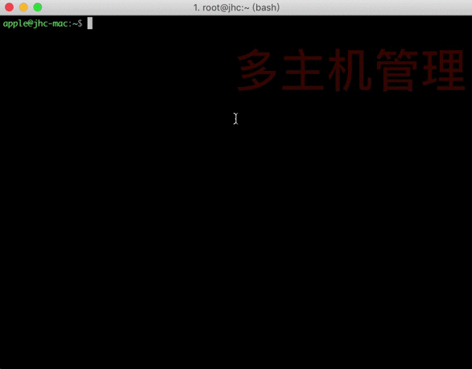

# 效果演示




# 基本功能

```python
1、记录主机用户和密码等信息，保存为主机列表
2、直接连接列表中记录的主机
3、删除主机功能
```


# 坏境需求


```python
1.python解释器版本 3.7或3.x
2.所需模块 pexpect==4.6.0
		安装方法 pip install pexpect==4.6.0
  
```


# 运行方法

```python
python MySSH/bin/start.py
#注意python解释器版本与路径
```


# 主机配置

```python
若主机数量较多，在MySSH/data/server.json中可以手动配置主机信息
```

